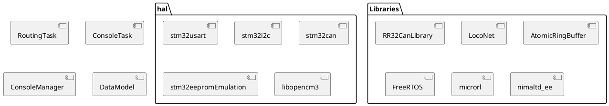
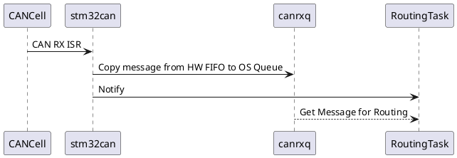
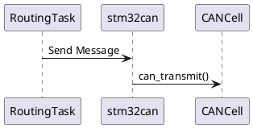

# C6021 Light Software Design

The c6021light software consists of several building blocks and several OS tasks.

## Tasks and Interrupts

The following FreeRTOS tasks exist in the system:

* RoutingTask
* ConsoleTask

ConsoleTask is a low-priority task, as it never blocks. RoutingTask is the highest-priority task in the system and is run only when there is data to be forwarded.

The following component make use of interrupts:

* stm32usart (DMA1 Channel4 Transmission Finished)
* stm32i2c (Transmission complete, I2C Error Handling)
* stm32can (CAN Message Received)
* LocoNet (TIM2 Timer Compare interrupt)

## Serial Command Line Interface and Output

c6021light makes use of the command line to print information data such as received and transmitted packages as well as to offer a command line interface to configure settings, such as the rail protocol to be used for turnout requests.

Implementation of this interface is spread over the following components:

* ConsoleTask
* ConsoleManager
* microrl
* stm32usart
* AtomicRingBuffer

stm32usart implements the serial communication to a remote device, e.g., a PC using a USB-to-Serial adapter. For the output path (c6021light to PC) stm32usart implements the `_write()` syscall. `_write()` copies the provided string data to a circular buffer (thereby using AtomicRingBuffer) and starts a DMA transfer to output the buffered data on the serial interface.

If the provided data fits into the buffer, the call returns after copying the data and starting the DMA. If the provided data does not fit into the buffer, `_write()` will busy-wait until all of the data could be forwarded into the buffer.

When the DMA transfer completes and there is data left in the buffer (e.g., because more data was added while a DMA transfer was ongoing), the DMA transfer is restarted with the new data.

For the input path (PC to c6021light), stm32usart provides the call `pollSerial()`. This call will return whether a character was read and if so, also return the appropriate character. `pollSerial()` is called by the ConsoleTask in an infinite loop, thereby polling for serial input. If data is read, ConsoleTask inputs the read data into microrl.

microrl provides command line parsing, command line history and command line completion. When a user enters a valid command, the command is mapped to a C function which is subsequently executed. ConsoleManager holds the configuration for microrl as well as the implementation of the applications.

## Runtime Configuration Data

c6021light allows runtime configurable settings to be done via the command line interface. The settings data is stored in the topmost program flash page. The following components interact with the configuration data:

* ConsoleManager
* DataModel
* stm32eepromEmulation
* nimaltd_ee

DataModel holds the actual runtime configuration data. All components wishing to read or write configuration data must do so by accessing a central instance of DataModel. ConsoleManager can be used to trigger a write of the current DataModel to persistent flash storage from the command line interface. Flash handling is performed by nimaltd_ee, where stm32eepromEmulation adds a few callbacks to map nimaltd_ee to libopencm3.

## Bus communciation routing

For every bus, there is a bus-specific communication implementation: stm32can, stm32i2c, LocoNet.

### stm32can

The stm32can part contains setup and reception/transmission of CAN messages. Messages are received through the CAN0 RX ISR. Whenever the interrupt is executed, all messages pending in the buffer are copied to a FreeRTOS queue and a task notification is sent to the RoutingTask.

For transmission, messages are synchronously sent to the transmit mailbox of the CAN cell.

All interaction is based on RR32Can data types.

### LocoNet

The LocoNet library uses a level change interrupt and a timer compare interrupt to simulate a UART interface in software. It makes use of Hardware Timer TIM2.

To receive a LocoNet packet, the SW UART implementation of LocoNet recieves individual bytes which are then stored in a circular buffer. ConsoleTask is currently abused to poll wheter LocoNet has received new bytes and if so, to wakte the RoutingTask. However, ConsoleTask will wake RoutingTask even if only a partial message was received. To determine whether a complete message was received, RoutingTask asks the LocoNet library for the next message. The LocoNet library will provide a message only when a complete message is available in the buffer.

Note that in case a message wraps around in the buffer, the LocoNet library will briefly suspend interrupts to copy the message to a contiguous location in the circular buffer.

To send a LocoNet message, LocoNet sets up a message for transmission and then busy-waits until the timer interrupt has finished sending all bytes of the message. busy-waiting is necessary as the dat ais read from the caller-provided pointer, it is not copied to an internal buffer.

### I2C

When idle, the I2C hardware is configured as an I2C slave with address 0x7F. Other devices may send messages to this ID. Message bytes are received by the I2C1 ISR. A message is considered to be completely received when an I2C Stop Condition occurs or when an I2C Bus Error interrupt occurs. The latter enables successful interaction with certain non-conforming devices. When a message is successefully received, it is enqueued in the i2crx FreeRTOS queue and the RoutingTask is woken.

To send a mesasge via I2C, a caller needs to put the message into the i2ctx queue and then call `startTx()`. If a transmission or reception is already ongoing, `startTx()` will do nothing. The next transmission or reception is started automatically once the current action completes. If no interaction is currently ongoing, `startTx()` causes the Hardware to send an I2C Start Condition which triggers subsequent calls to the I2C ISR, which then, in turn, transmits the individual bytes of the message.

When the I2C bus is empty, apart from c6021light, every attempt at transmission will be met with an Acknowledgement Failure (AF). In case of an AF, the current message is discarded. The I2C interface is not sent into an error state but following messages are transmitted in the same way. If the bus remains empty, every message will be discarded with an acknowledgement failure. If a device "suddenly" appears on the bus that receives the message, communication will resume.

## RoutingTask

The operating principle of the routing task is that messages received from every bus are first converted into their representation as it would be on the CAN bus. Next, a routing decision is taken. Currently, the routing decision is to forward a message to every bus apart from the bus that it was received from. Finally, for every bus, the CAN representation is converted to the respective bus representation and a message is sent on the respective bus.

Note that for most busses, the respective library used offers capabilities to decode and handle or to send bus messages. However, for many cases these implementations are not used, as the resulting software design leads to a jumble of hard-to-follow callbacks and repeated implementation of routing decisions and forwardings. However, to enable operations other than forwarding, the c6021light considers itself to be a RR32Can::Station instance that is not directly connected to any bus. Instead, the RoutingTask forwards every received message to the RR32Can::Station for processing.

Currently, the only processing that occurs is to turn on the LED on PC13 if any bus signals a stop mode and to turn off the LED if any bus signals a start mode.