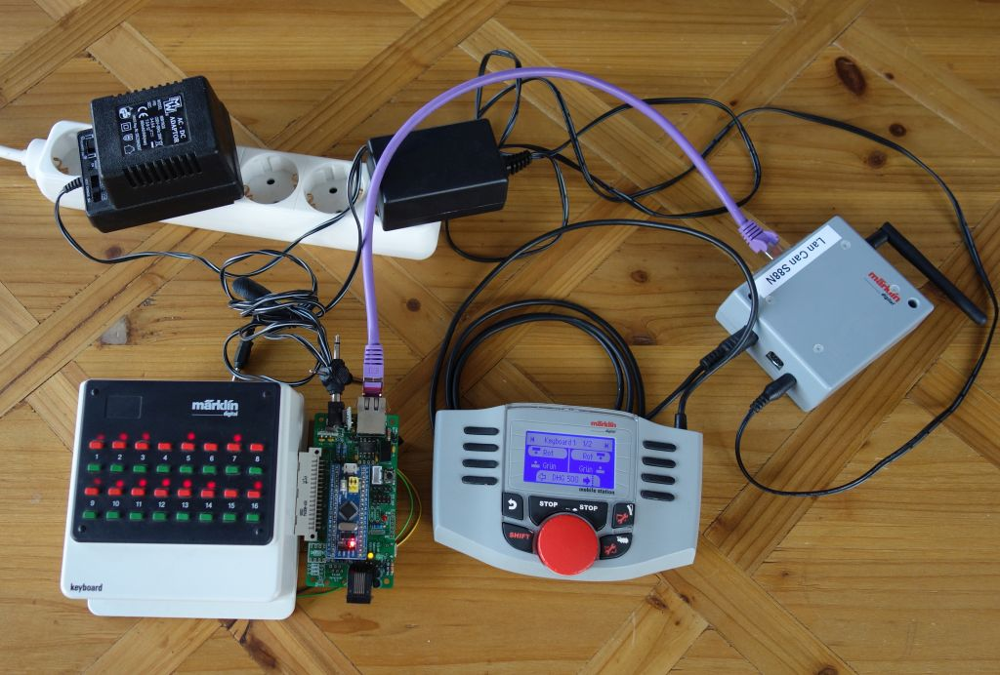
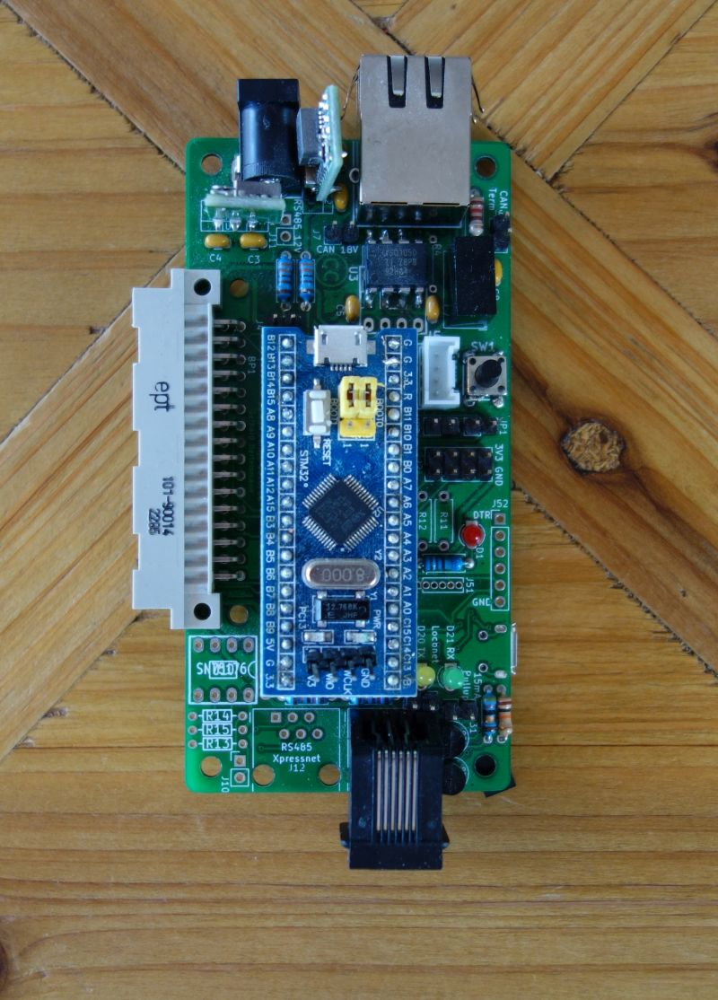
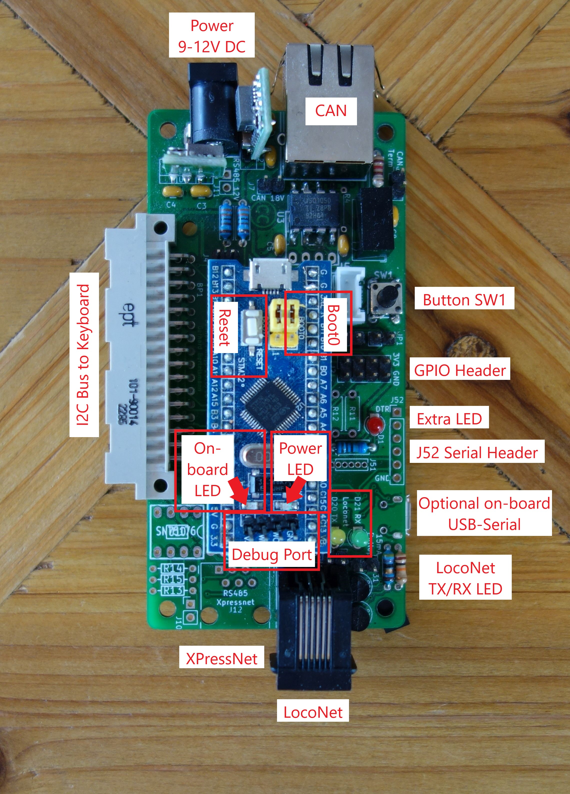
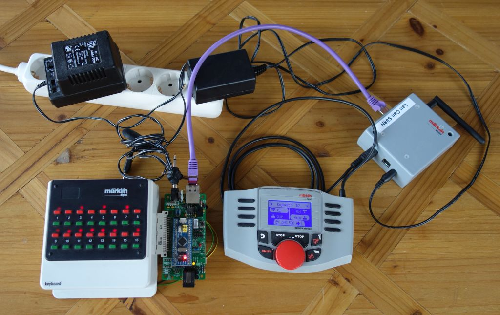

# Getting Started with the c6021light

So you have just soldered up your c6021light and now want to connect it to your model railroad layout. In this getting started guide we will show you how to start using your c6021light with a simple example setup.

## Prerequisites

To follow this guide, you will need the following:

* A c6021light loaded with firmware. If you need to update or install the firmware on your c6021light, please follow the [Instructions for Build & Upload](https://github.com/deltaphi/c6021light/wiki/Build-&-Upload) from the project Wiki. Continue reading here once you have the firmware installed on your c6021light.
* Power Supply for the c6021light. ([Example](images/c6021light_with_PSU.jpg))
* A Märklin Mobile Station 2 and Märklin Gleisbox. ([Example](images/ms2_gleisbox_srseii.jpg)))
* An RJ45 CAN breakoutport built into the Märklin Gleisbox or an Adapter cable to connect the Märklin Gleisbox to the RJ45 CAN port on the c6021light.
* A Märklin 6040 Keyboard. ([Example](images/Keyboard6040.jpg))

In our example setup, we will use a Märklin Gleisbox that has been modded with a [SRSEII](http://lnxpps.de/can2udp/srseII/) to get access to the CAN bus and a c6021light with the optional on-board USB-to-serial converter. For the purpose of the example, we run with no railway layout connected to the Gleisbox. However, we assume that turnouts on the railway layout are controlled using the MM2 protocol. Finally, we assume that the Märklin Keyboard is configured to address 0 (all DIP switches on the back set to the "Off" position). See an overview of our example system:

## First look at the c6021light

The PCB of the c6021light looks roughly as shown in the image below. Depending on your specific setup and PCB revision, the details may be slightly different. Let's take a closer look at what we are seeing here.

At the center of the board, we can first see the BluePill board containing an STM32 Microprocessor - the heart and brain of the c6021light. On and around the PCB, we can see a bunch of connectors, LEDs and a button. We will first take a look at the connectors and then examine the LEDs and Button.
All elements described in the following are labelled in this picture:

### Connectors

At the top of the board, we see a barrel jack and an RJ45 port. The Barrel Jack is for power supply to the board, the I2C bus (i.e., the Märklin Keyboard in our example) and optionally other busses as well. The input voltage depends on the on-board voltage regulators used. It is recommended to use a 9V or 12V power supply.

The RJ45 port is the connector to the CAN bus. Its pin layout follows the Can Digital Bahn Project. You can download the pin layout from the [Can Digital Bahn Download Area](http://can-digital-bahn.com/infusions/pro_download_panel/download.php?did=35).

Moving around the board counter-clockwise, we next encounter the connector to the I2C bus, i.e., the Märklin Keyboard in our example. It is possible to mount straight or angled, male or female connectors. Your PCB may look different, depending on the connector you chose. In thie example, the c6021light is fitted with an angled male connector. Thus, it can be connected on the right hand side of the Märklin Keyboard.

On the bottom of the PCB, we find two more RJ11 connectors. The connector on the left (not populated in the image) connects to an XpressNet bus. The connector on the right offers a connection to a LocoNet network.

On the right hand side of the PCB, there are three more connectors. Bottommost is an optional Micro USB port, used for the optional on-board USB-to-Serial adapter (located on the back side of the PCB). Directly above the Micro USB port there is the Pin Header J52. J52 gives access to the same serial port as the on-board USB-to-Serial adapter. If you have not yet populated the on-board USB-to-Serial adapter, it is recommended to use an easily available USB-to-serial adapter board on J52 instead.

*Note [Issue #7](https://github.com/deltaphi/c6021light/issues/7): On some versions of the c6021light PCB, the RX and TX lines on J52 are swapped. If your PCB is affected by this bug, use jumper cables to connect the USB-to-serial adapter to the c6021light and cross over RX and TX in the process.*

Above J52, there is another 2x4 pin header. This pin header provides access to six GPIO pins of the processor as well as a 3.3V power supply and a Ground pin. It is intended for future expansion projects. If you plan an expansion project, please note that the 3.3V supply is fed from the on-board power regulator of the BluePill board. This regulator is not very powerful - i.e., you cannot draw a lot of current from this pin header.

Moving from the rim of the PCB to the center, there are two more noteworthy ports. At the bottom of the BluePill board, there is a small Pin header. This is the debugger port (e.g., ST-Link V2). Typical users do not need to use a debugger. However, having a debugger does come in handy for software development and to find more complex software issues.

At the top of the BluePill board, there is another Micro-USB port. This port is disabled and cannot be used on the c6021light. Do not connect anything to this port.

### On-Board Interfaces

The c6021light and the BluePill board feature a number of LEDs for information output as well as buttons and jumpers for configuration. Currently, most of these are unused. However, we will cover all of them for completeness. We begin by looking at the LEDs and then move on to the buttons and jumpers.

#### LEDs

Starting at the bottom of the BluePill board, we first see two LEDs right above the debugger port. The red LED on the right indicates whether the BluePill board is powered (LED lights up). The yellow LED on the left is currently used to indicate the Stop/Go state of the system (i.e., whether track power is off or on), if that information is known to the c6021light.

Off to the right, next to J52, there is another red LED. This LED is currently unused.

Below the red LED, next to the LocoNet port, there are two more LEDs. These LEDs indicate message transmission (LED to the right) and message reception (led to the left) on the LocoNet port.

#### Jumpers and Buttons

We again start by examining the BluePill board. At the top left of the board, we see a white button. This is the RESET button. To the right of the RESET button, we see two yellow jumpers labeled "Boot1" (left) and "Boot0" (right). Boot1 is currently unused. Boot0 is important when using a USB-to-serial connection to upload the firmware to the c6021light. More details on Boot0 are available in the [Instructions for Build & Upload](https://github.com/deltaphi/c6021light/wiki/Build-&-Upload) on the project Wiki.

Last, there is one more button off to the top right of the c6021light. This button is currently unused.

## Connecting the c6021light

To start using the c6021light in our example, start by plugging the c6021light into the Märklin Keyboard. Second, use an RJ45 network cable (straight cable, not a crossover cable!) to connect the c6021light to the CAN port of the Gleisbox. Next, connect the USB-to-serial adapter to the c6021light and to your PC. 

To power up the system, apply power to the Gleisbox and plug in the power supply for the c6021light.

* Note that in the current software version, the order in which you power up the devices does not matter. However, later software versions may make assumptions about whether other devices have already been powered up. We recommend to plug the Gleisbox and the c6021light into a common switchable power strip and thereby switch both devices on and off at the same time.*

The powered-up system should look roughly as follows:

Ensure that the Display of the Mobile Station 2 lights up and the Mobile Station 2 goes to its regular operating state, that the Power LED on the BluePill board turns on and that at least one LED on the Keyboard lights up.

### Troubleshooting

If the Power LED on the c6021light does not light up, ensure that the power supply for the c6021light is firmly connected to the board and that it is plugged into a live power outlet.

If no LED lights up on the Keyboard, make sure that the Keyboard is connected to the c6021light. Note that the connectors between Keyboard and c6021light do not excert substantial holding force. They can be connected and disconnected with little effort. For a good connection, the housing of the connector on the c6021light should brush against the housing of the Keyboard.

If the display of the Mobile Station 2 does not light up, ensure that the Gleisbox is powered. If the Gleisbox is powered, there may be an electrical problem on the CAN bus. Verify whether the Mobile Station 2 works when you have the Gleisbox connected only to power and to the Mobile Station 2.

If the display of the Mobile Station 2 lights up but the Mobile Station 2 does not enter its regular operating state, there is likely an error on the CAN bus. Try disconnecting the c6021light from the Mobile Station 2 and power-cycle the Gleisbox.

## First operation

A freshly installed c6021light runs at its default settings. This means that it will transfer turout control commands, S88 sensor reports and the Stop/Go state between all attached busses. Turnout Control commands on the CAN bus are sent to turnout decoders using the MM2 protocol by default.

If your turnout decoders are using the MM2 protocol, you are now ready to test out the c6021light. Start by ensuring that system is in the "Go" state (track power is on, even if no track is connected). To this end, verify that the display of the Mobile Station 2 does *not* say "STOP". If it does, press the "STOP" button to put the system in the "Go" state. For reference, see images of the Mobile Station 2 on the default locomotive control screen in the [Stop mode](images/ms2_loco_stop.jpg) and the [Go mode](images/ms2_loco_go.jpg), as well as on the turnout control screen in the [Stop mode](images/ms2_turnout_stop.jpg) and the [Go mode](images/ms2_turnout_go.jpg). Next, bring up the turnout screen on the Mobile Station 2 by pressing the turnout button. You should see two turnouts presented in the screen. The label at the top indicates that you are seeing turnouts 1 and 2.

Now start switching Turnouts 1 and 2 back and forth on the Keyboard. You should now see the screen on the Mobile Station 2 reflect your turnout changes. If you happen to have a railroad layout connected to your Gleisbox, turnouts 1 and 2 will be switching.

Next, start switching Turnouts 1 and 2 back and forth on the Mobile Station 2. You should now see the indicator LED on the Keyboard reflect your turnout changes. If you happen to have a railroad layout connected to your Gleisbox, turnouts 1 and 2 will be switching.

 For reference, see the two following images showing an identical system, save for turnout 2 being switched to green in the second picture:

 
 

If everything worked: Congratulations, you are now ready to use the c6021light!

### Troubleshooting

If turnout indicators do not change when you toggle the turnouts on either device, check whether the System is in the "Go" state. In the "Stop" state, the Gleisbox receives the turnout requests but does not generate response messages. Thus, indicators will not update.

If you control turnouts from the Mobile Station 2 and see the indicators update only on the Mobile Station 2, verify that the calbe for the CAN connection is firmly connected to the Gleisbox and the c6021light and that you are not using a crossover cable.
